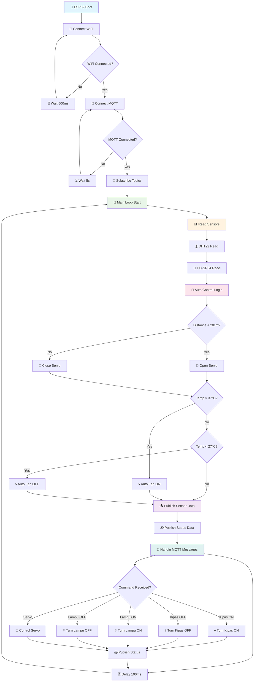
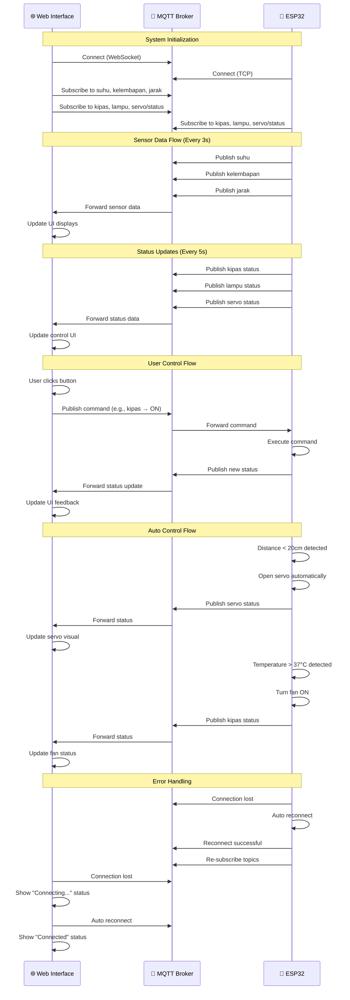
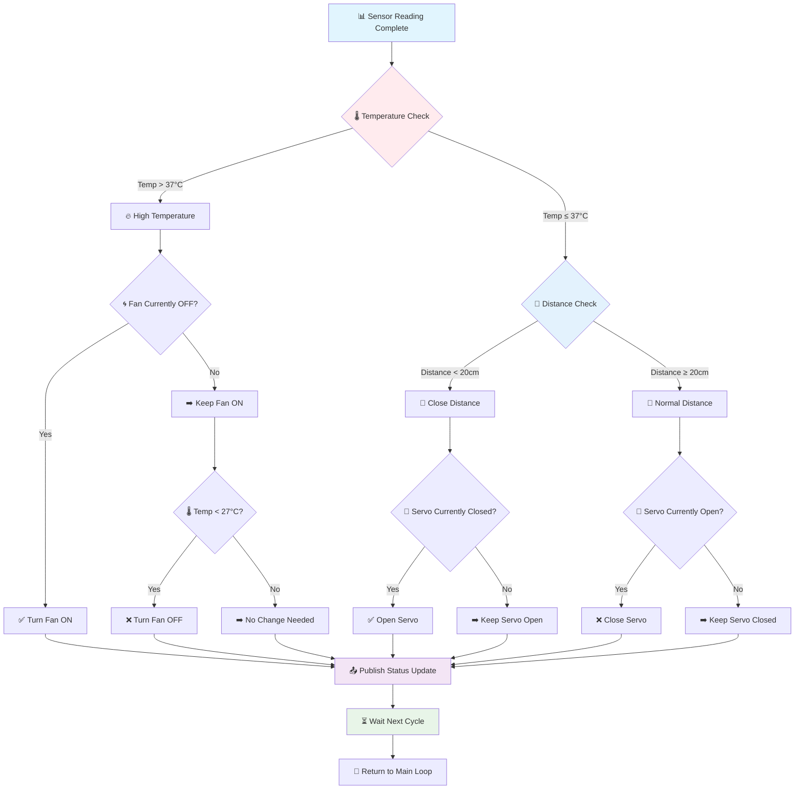
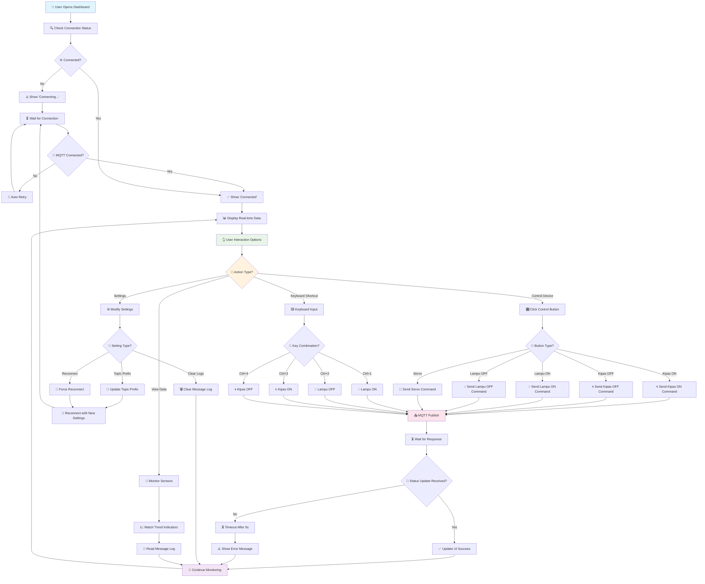

<h1 align="center"> ESP32 MQTT Control & Monitoring Dashboard

<p align="center">
  
  
  
  
</p>

## 🎯 Overview

A real-time ESP32-based monitoring and control system using MQTT with a modern, glassmorphism-style web interface deployable on GitHub Pages. The system enables seamless communication between an ESP32 microcontroller and a web dashboard via MQTT for real-time sensor monitoring and device control.

## ✨ Key Features

### 🌐 Web Interface
- **Real-time Monitoring** - Automatic updates of sensor data via MQTT
- **Glassmorphism UI** - Elegant, transparent design with smooth blur effects and animations
- **Responsive Design** - Optimized for desktop, tablet, and mobile devices
- **MQTT Message Log** - Real-time logging of MQTT messages with timestamps
- **Connection Status** - Visual indicator with auto-reconnect functionality
- **Keyboard Shortcuts** - Quick control using keyboard commands
- **Trend Indicators** - Visual cues for sensor data trends (rising/falling)
- **Settings Panel** - Configurable MQTT topic prefix and broker settings
- **Auto Scroll** - Message log automatically scrolls to the latest entry

### 🔧 ESP32 Features
- **Multi-sensor Support** - DHT22 (temperature/humidity), HC-SR04 (distance)
- **Dual Relay Control** - Control of light and fan with status feedback
- **Servo Automation** - Automatic door simulation based on distance
- **MQTT Communication** - Pub/Sub pattern for reliable real-time interaction
- **Auto Control Logic** - Fan activates based on temperature with hysteresis
- **WiFi Auto-reconnect** - Stable WiFi and MQTT connections
- **Built-in LED Indicator** - Visual feedback for WiFi connection status
- **Command Debouncing** - Prevents command spamming for reliable operation

## 📋 Requirements

### Hardware
- ESP32 Development Board
- DHT22 Temperature & Humidity Sensor
- HC-SR04 Ultrasonic Distance Sensor
- 2x Relay Module (5V)
- SG90 Servo Motor
- LED Indicator (Built-in on GPIO 2)
- Breadboard and jumper wires
- 5V Power Supply (for relays)

### Software
- Arduino IDE with ESP32 board package
- Libraries: `PubSubClient`, `DHT`, `ESP32Servo`, `ArduinoJson`
- Modern web browser with WebSocket support
- GitHub account (for GitHub Pages deployment)

## 🔌 Pin Configuration

```cpp
#define DHTPIN 17         // DHT22 data pin (GPIO 17)
#define TRIG_PIN 4        // HC-SR04 trigger pin
#define ECHO_PIN 16       // HC-SR04 echo pin
#define RELAY_LAMPU 27    // Relay for light
#define RELAY_KIPAS 26    // Relay for fan
#define SERVO_PIN 15      // Servo control pin
#define LED_PIN 2         // Built-in LED (GPIO 2)
```

## 🚀 Installation

### 1. ESP32 Setup

#### Install Required Libraries
```bash
# In Arduino IDE, go to Tools > Manage Libraries
# Install the following libraries:
- PubSubClient by Nick O'Leary
- DHT sensor library by Adafruit
- ESP32Servo by Kevin Harrington
- ArduinoJson by Benoit Blanchon
```

#### Upload Code
1. Open Arduino IDE
2. Copy the ESP32 code from `esp32_mqtt_code.ino`
3. Update WiFi credentials:
   ```cpp
   const char* ssid = "YOUR_WIFI_SSID";
   const char* password = "YOUR_WIFI_PASSWORD";
   ```
4. Select board: `ESP32 Dev Module`
5. Choose the correct COM port
6. Upload the code to the ESP32

### 2. Web Interface Setup

#### Option 1: GitHub Pages (Recommended)
1. Fork this repository
2. Enable GitHub Pages in repository settings
3. Select source: `Deploy from a branch`
4. Choose branch: `main` and folder: `/ (root)`
5. Access via the GitHub Pages URL: `https://username.github.io/repository-name`

#### Option 2: Local Development
```bash
# Using Python
python -m http.server 8000

# Using Node.js
npx http-server

# Using PHP
php -S localhost:8000
```

## 📡 MQTT Topics Structure

### Sensor Data (ESP32 → Web)
```
ESP32-IoT/suhu          # Temperature in Celsius (float)
ESP32-IoT/kelembapan    # Humidity in % (float)
ESP32-IoT/jarak         # Distance in cm (integer)
```

### Device Status (ESP32 → Web)
```
ESP32-IoT/kipas         # Fan status: ON/OFF
ESP32-IoT/lampu         # Light status: ON/OFF
ESP32-IoT/servo/status  # Servo status: TERBUKA/TIDAK TERBUKA
```

### Control Commands (Web → ESP32)
```
ESP32-IoT/kipas         # Fan command: ON/OFF
ESP32-IoT/lampu         # Light command: ON/OFF
ESP32-IoT/servo/status  # Servo command: TERBUKA/TIDAK TERBUKA
```

## 🎮 Usage

### Basic Operation
1. **Power ESP32** - Connect to a power supply and verify wiring
2. **Check Serial Monitor** - Set baud rate to 115200; confirm WiFi and MQTT connections
3. **Open Web Interface** - Access the dashboard in a browser
4. **Wait for Connection** - A green "Connected" status will appear
5. **Monitor & Control** - Sensor data updates automatically; use control buttons for interaction

### Keyboard Shortcuts
- `Ctrl + 1` - Light ON
- `Ctrl + 2` - Light OFF
- `Ctrl + 3` - Fan ON
- `Ctrl + 4` - Fan OFF

### Automatic Features
- **Servo Control**: Opens automatically if distance < 20cm (door simulation)
- **Fan Control**: Activates if temperature > 37°C
- **Hysteresis**: Fan turns OFF if temperature < 27°C to prevent oscillation
- **LED Indicator**: Built-in LED reflects WiFi connection status

## ⚙️ Configuration

### ESP32 Configuration
```cpp
// WiFi Settings
const char* ssid = "Sadin";
const char* password = "Dinda12345";

// MQTT Settings
const char* mqttServer = "broker.emqx.io";
const int mqttPort = 1883;
const char* topicPrefix = "ESP32-IoT";

// Timing Configuration
const unsigned long sensorInterval = 2000;   // Read sensors every 2s
const unsigned long publishInterval = 3000;  // Publish data every 3s
const unsigned long reconnectInterval = 5000; // Retry every 5s
```

### Web Interface Configuration
```javascript
// MQTT Configuration
const MQTT_BROKER = "wss://broker.emqx.io:8084/mqtt";
let TOPIC_PREFIX = "ESP32-IoT";

// UI Configuration
const MAX_LOG_ENTRIES = 50;
const RECONNECT_INTERVAL = 3000;
const COMMAND_TIMEOUT = 5000;
```

## 🔧 Troubleshooting

### Common Issues

#### 1. ESP32 Not Connecting to WiFi
**Solutions:**
- Verify WiFi credentials in the code
- Ensure the network is 2.4GHz (not 5GHz)
- Reset the ESP32 and retry
- Check WiFi signal strength
- Monitor serial output for error messages

#### 2. MQTT Connection Failed
**Solutions:**
- Confirm internet connectivity
- Test an alternative MQTT broker (e.g., test.mosquitto.org)
- Disable VPN or proxy
- Check firewall settings
- Ensure browser WebSocket support

#### 3. Sensor Not Reading
**Solutions:**
- Verify sensor pin connections (DHT22 on GPIO 17)
- Ensure adequate power supply (5V for relays)
- Test sensors individually
- Confirm pin configuration in code
- Replace faulty sensors

#### 4. Web Interface Not Loading
**Solutions:**
- Enable JavaScript in the browser
- Clear browser cache and cookies
- Try a different browser (Chrome/Firefox recommended)
- Check browser console for errors
- Ensure HTTPS for GitHub Pages

#### 5. Relay Not Working
**Solutions:**
- Verify relay module wiring
- Confirm 5V power supply for relays
- Test relays with a multimeter
- Check pin configuration (GPIO 26, 27)
- Replace faulty relay modules

## 📊 System Architecture

```
┌─────────────────┐    WiFi     ┌──────────────┐    WebSocket    ┌─────────────────┐
│     ESP32       │◄───────────►│ MQTT Broker  │◄───────────────►│  Web Interface  │
│                 │             │ (EMQX)       │                 │   (Browser)     │
│ - DHT22         │             │              │                 │ - Real-time UI  │
│ - HC-SR04       │             │ - Pub/Sub    │                 │ - Controls      │
│ - Relays        │             │ - QoS        │                 │ - Monitoring    │
│ - Servo         │             │ - WebSocket  │                 │ - Glassmorphism │
│ - Auto Control  │             │ - Retain     │                 │ - Logs          │
└─────────────────┘             └──────────────┘                 └─────────────────┘
```

## 📊 Flowchart System

### 🔄 ESP32 Main Loop Flowchart



### 🔄 MQTT Communication Flow



### 🎯 Decision Tree - Auto Control Logic



### 📱 User Interaction Flow



## 🔒 Security Considerations

- Gunakan MQTT broker dengan authentication untuk production
- Implementasi SSL/TLS untuk koneksi aman
- Batasi akses topic dengan ACL
- Gunakan strong WiFi password
- Regular update firmware ESP32

## 🚀 Advanced Features

### Custom MQTT Broker
Untuk menggunakan broker MQTT sendiri:

1. **ESP32**: Ubah `mqttServer` dan `mqttPort`
2. **Web**: Update `MQTT_BROKER` URL
3. **Authentication**: Tambahkan username/password jika diperlukan

### Data Logging
Tambahkan fitur logging dengan:
- InfluxDB untuk time-series data
- Grafana untuk visualisasi
- Node-RED untuk automation

### Mobile App
Buat mobile app dengan:
- React Native + MQTT.js
- Flutter dengan mqtt_client
- Ionic dengan Paho MQTT

## 📈 Performance Optimization

### ESP32 Optimization
```cpp
// Reduce sensor reading frequency
const unsigned long sensorInterval = 5000;  // 5 seconds

// Optimize MQTT keepalive
client.setKeepAlive(90);

// Use QoS 0 for frequent data
client.publish(topic, data, false);  // QoS 0, no retain
```

### Web Optimization
```javascript
// Limit log entries
while (messageLog.children.length > 50) {
    messageLog.removeChild(messageLog.firstChild);
}

// Debounce button clicks
const debounce = (func, wait) => {
    let timeout;
    return function executedFunction(...args) {
        const later = () => {
            clearTimeout(timeout);
            func(...args);
        };
        clearTimeout(timeout);
        timeout = setTimeout(later, wait);
    };
};
```

## 🤝 Contributing

Kontribusi sangat diterima! Silakan:

1. Fork repository
2. Buat feature branch: `git checkout -b feature/amazing-feature`
3. Commit changes: `git commit -m 'Add amazing feature'`
4. Push ke branch: `git push origin feature/amazing-feature`
5. Buat Pull Request

### Development Guidelines
- Follow existing code style
- Test pada multiple browsers
- Update dokumentasi
- Include screenshots untuk UI changes

## 📝 License

Project ini menggunakan MIT License. Lihat file `LICENSE` untuk detail.

## 🙏 Acknowledgments

- **EMQX** untuk free MQTT broker
- **MQTT.js** untuk WebSocket MQTT client
- **Arduino Community** untuk libraries
- **ESP32 Community** untuk support dan dokumentasi

## 📞 Support

- **Issues**: [GitHub Issues](https://github.com/your-repo/issues)
- **Discussions**: [GitHub Discussions](https://github.com/your-repo/discussions)
- **Email**: your-email@example.com

## 🔗 Useful Links

- [ESP32 Documentation](https://docs.espressif.com/projects/esp-32/en/latest/)
- [MQTT.js Documentation](https://github.com/mqttjs/MQTT.js)
- [EMQX Broker](https://www.emqx.io/)
- [Arduino ESP32 Guide](https://randomnerdtutorials.com/getting-started-with-esp32/)

---

<div align="center">

**⭐ Star this repository if you found it helpful!**

Made with ❤️ for the IoT community

<p><a href="#top">⬆ Back on Top</a></p>

</div>
