<h1 align="center"> ESP32 MQTT Control & Monitoring Dashboard

<p align="center">
  
  
  
  
</p>

## 🎯 Overview

Sistem monitoring dan kontrol ESP32 berbasis MQTT dengan antarmuka web modern yang dapat digunakan di GitHub Pages. Sistem ini menyediakan komunikasi real-time antara ESP32 dan web interface menggunakan protokol MQTT.

## ✨ Fitur Utama

### 🌐 Web Interface
- **Real-time Monitoring** - Data sensor diperbarui secara otomatis via MQTT
- **Modern UI** - Desain glassmorphism dengan animasi smooth
- **Responsive Design** - Optimal di desktop, tablet, dan mobile
- **MQTT Message Log** - Log real-time semua komunikasi MQTT
- **Connection Status** - Indikator status koneksi dengan auto-reconnect
- **Keyboard Shortcuts** - Kontrol cepat dengan shortcut keyboard
- **Trend Indicators** - Indikator naik/turun untuk data sensor

### 🔧 ESP32 Features
- **Multi-sensor Support** - DHT22 (suhu/kelembapan) + HC-SR04 (jarak)
- **Dual Relay Control** - Kontrol lampu dan kipas
- **Servo Automation** - Servo otomatis berdasarkan jarak
- **MQTT Communication** - Pub/Sub pattern untuk komunikasi real-time
- **Auto Control** - Kipas otomatis berdasarkan suhu/kelembapan
- **WiFi Auto-reconnect** - Koneksi WiFi dan MQTT yang stabil

## 📋 Requirements

### Hardware
- ESP32 Development Board
- DHT22 Temperature & Humidity Sensor
- HC-SR04 Ultrasonic Distance Sensor
- 2x Relay Module (5V)
- SG90 Servo Motor
- LED indicators (optional)
- Breadboard dan jumper wires

### Software
- Arduino IDE dengan ESP32 board package
- Libraries: `PubSubClient`, `DHT`, `ESP32Servo`, `ArduinoJson`
- Modern web browser dengan WebSocket support

## 🔌 Pin Configuration

```cpp
#define DHTPIN 2          // DHT22 data pin
#define TRIG_PIN 4        // HC-SR04 trigger pin
#define ECHO_PIN 16       // HC-SR04 echo pin
#define RELAY_LAMPU 27    // Relay untuk lampu
#define RELAY_KIPAS 26    // Relay untuk kipas
#define SERVO_PIN 15      // Servo control pin
```

## 🚀 Installation

### 1. ESP32 Setup

#### Install Required Libraries
```bash
# Di Arduino IDE, buka Tools > Manage Libraries
# Install libraries berikut:
- PubSubClient by Nick O'Leary
- DHT sensor library by Adafruit
- ESP32Servo by Kevin Harrington
- ArduinoJson by Benoit Blanchon
```

#### Upload Code
1. Buka Arduino IDE
2. Copy kode ESP32 dari file `esp32_mqtt_code.ino`
3. Ganti `YOUR_WIFI_SSID` dan `YOUR_WIFI_PASSWORD`
4. Select board: `ESP32 Dev Module`
5. Upload ke ESP32

### 2. Web Interface Setup

#### Option 1: GitHub Pages
1. Fork repository ini
2. Enable GitHub Pages di repository settings
3. Akses via URL GitHub Pages

#### Option 2: Local Server
```bash
# Menggunakan Python
python -m http.server 8000

# Menggunakan Node.js
npx http-server
```

## 📡 MQTT Topics Structure

### Sensor Data (ESP32 → Web)
```
ESP32-IoT/sensors/temperature    # Suhu dalam Celsius
ESP32-IoT/sensors/humidity       # Kelembapan dalam %
ESP32-IoT/sensors/distance       # Jarak dalam cm
```

### Device Status (ESP32 → Web)
```
ESP32-IoT/relays/kipas/status    # Status kipas: ON/OFF
ESP32-IoT/relays/lampu/status    # Status lampu: ON/OFF
ESP32-IoT/servo/status           # Status servo: TERBUKA/TIDAK TERBUKA
```

### Control Commands (Web → ESP32)
```
ESP32-IoT/relays/kipas/command   # Perintah kipas: ON/OFF
ESP32-IoT/relays/lampu/command   # Perintah lampu: ON/OFF
```

## 🎮 Usage

### Basic Operation
1. **Power ESP32** - Hubungkan ke power supply
2. **Check Serial Monitor** - Pastikan WiFi dan MQTT terhubung
3. **Open Web Interface** - Buka dashboard di browser
4. **Wait for Connection** - Status "Connected" akan muncul
5. **Monitor & Control** - Data sensor update otomatis, gunakan tombol kontrol

### Keyboard Shortcuts
- `Ctrl + 1` - Lampu ON
- `Ctrl + 2` - Lampu OFF  
- `Ctrl + 3` - Kipas ON
- `Ctrl + 4` - Kipas OFF

### Automatic Features
- **Servo Control**: Terbuka otomatis jika jarak < 20cm
- **Fan Control**: ON otomatis jika suhu > 30°C atau kelembapan > 70%
- **Hysteresis**: Kipas OFF jika suhu < 28°C dan kelembapan < 65%

## ⚙️ Configuration

### ESP32 Configuration
```cpp
// WiFi Settings
const char* ssid = "YOUR_WIFI_SSID";
const char* password = "YOUR_WIFI_PASSWORD";

// MQTT Settings  
const char* mqttServer = "broker.emqx.io";
const int mqttPort = 1883;
const char* topicPrefix = "ESP32-IoT";
```

### Web Interface Configuration
```javascript
// MQTT Configuration
const MQTT_BROKER = "wss://broker.emqx.io:8084/mqtt";
let TOPIC_PREFIX = "ESP32-IoT";
```

## 🔧 Troubleshooting

### Common Issues

#### 1. ESP32 Not Connecting to WiFi
**Solutions:**
- Periksa kredensial WiFi di kode
- Pastikan jaringan WiFi 2.4GHz (bukan 5GHz)
- Reset ESP32 dan coba lagi
- Periksa jangkauan WiFi

#### 2. MQTT Connection Failed
**Solutions:**
- Periksa koneksi internet
- Coba broker MQTT lain
- Disable VPN/proxy
- Periksa firewall settings

#### 3. Sensor Not Reading
**Solutions:**
- Periksa koneksi pin sensor
- Pastikan power supply cukup (5V untuk relay)
- Test sensor secara individual
- Periksa kode pin configuration

#### 4. Web Interface Not Loading
**Solutions:**
- Enable JavaScript di browser
- Clear browser cache
- Coba browser lain
- Periksa console untuk error

## 📊 System Architecture

```
┌─────────────────┐    WiFi     ┌──────────────┐    WebSocket    ┌─────────────────┐
│     ESP32       │◄───────────►│ MQTT Broker  │◄───────────────►│  Web Interface  │
│                 │             │ (EMQX)       │                 │   (Browser)     │
│ - DHT22         │             │              │                 │ - Real-time UI  │
│ - HC-SR04       │             │ - Pub/Sub    │                 │ - Controls      │
│ - Relays        │             │ - QoS        │                 │ - Monitoring    │
│ - Servo         │             │ - Retain     │                 │ - Logs          │
└─────────────────┘             └──────────────┘                 └─────────────────┘
```

## 📊 Flowchart Sistem

### 🔄 ESP32 Main Loop Flowchart

```mermaid
flowchart TD
    A[🚀 ESP32 Boot] --> B[📶 Connect WiFi]
    B --> C{WiFi Connected?}
    C -->|No| D[⏳ Wait 500ms] --> B
    C -->|Yes| E[📡 Connect MQTT]
    E --> F{MQTT Connected?}
    F -->|No| G[⏳ Wait 5s] --> E
    F -->|Yes| H[📝 Subscribe Topics]
    H --> I[🔄 Main Loop Start]
    
    I --> J[📊 Read Sensors]
    J --> K[🌡️ DHT22 Read]
    K --> L[📏 HC-SR04 Read]
    L --> M[🤖 Auto Control Logic]
    
    M --> N{Distance < 20cm?}
    N -->|Yes| O[🚪 Open Servo]
    N -->|No| P[🚪 Close Servo]
    
    O --> Q{Temp > 30°C OR Humidity > 70%?}
    P --> Q
    Q -->|Yes| R[🌀 Auto Fan ON]
    Q -->|No| S{Temp < 28°C AND Humidity < 65%?}
    S -->|Yes| T[🌀 Auto Fan OFF]
    S -->|No| U[📤 Publish Sensor Data]
    R --> U
    T --> U
    
    U --> V[📤 Publish Status Data]
    V --> W[📨 Handle MQTT Messages]
    W --> X[⏳ Delay 100ms]
    X --> I
    
    W --> Y{Command Received?}
    Y -->|Kipas ON| Z1[🌀 Turn Kipas ON]
    Y -->|Kipas OFF| Z2[🌀 Turn Kipas OFF]
    Y -->|Lampu ON| Z3[💡 Turn Lampu ON]
    Y -->|Lampu OFF| Z4[💡 Turn Lampu OFF]
    
    Z1 --> AA[📤 Publish Status]
    Z2 --> AA
    Z3 --> AA
    Z4 --> AA
    AA --> X
    
    style A fill:#e1f5fe
    style I fill:#e8f5e8
    style J fill:#fff3e0
    style M fill:#fce4ec
    style U fill:#f3e5f5
    style W fill:#e0f2f1
```



### 🌐 Web Interface Flowchart

```mermaid
flowchart TD
    A1[🌐 Load Web Page] --> B1[📚 Load Libraries]
    B1 --> C1{MQTT.js Loaded?}
    C1 -->|No| D1[❌ Show Error] --> E1[🔄 Retry Load]
    E1 --> B1
    C1 -->|Yes| F1[🔗 Connect MQTT Broker]
    
    F1 --> G1{MQTT Connected?}
    G1 -->|No| H1[⏳ Wait 1s] --> I1[🔄 Retry Connection] --> F1
    G1 -->|Yes| J1[📝 Subscribe All Topics]
    
    J1 --> K1[✅ Update UI Status: Connected]
    K1 --> L1[🔄 Main Event Loop]
    
    L1 --> M1[📨 Listen MQTT Messages]
    M1 --> N1{Message Type?}
    
    N1 -->|Sensor Data| O1[📊 Update Sensor Display]
    N1 -->|Relay Status| P1[🔘 Update Control Buttons]
    N1 -->|Servo Status| Q1[🚪 Update Servo Visual]
    
    O1 --> R1[📈 Calculate Trends]
    R1 --> S1[🎨 Update UI Animations]
    
    P1 --> T1[🎨 Update Status Badges]
    Q1 --> U1[🎨 Update Door Icon]
    
    S1 --> V1[📝 Add to Message Log]
    T1 --> V1
    U1 --> V1
    
    V1 --> W1{Auto Scroll Enabled?}
    W1 -->|Yes| X1[⬇️ Scroll to Bottom]
    W1 -->|No| Y1[📍 Keep Position]
    
    X1 --> Z1[⏳ Wait for Next Message]
    Y1 --> Z1
    Z1 --> M1
    
    L1 --> AA1[👆 Handle User Clicks]
    AA1 --> BB1{Button Clicked?}
    BB1 -->|Kipas ON| CC1[📤 Publish: kipas/command → ON]
    BB1 -->|Kipas OFF| CC2[📤 Publish: kipas/command → OFF]
    BB1 -->|Lampu ON| CC3[📤 Publish: lampu/command → ON]
    BB1 -->|Lampu OFF| CC4[📤 Publish: lampu/command → OFF]
    
    CC1 --> DD1[🎨 Button Animation]
    CC2 --> DD1
    CC3 --> DD1
    CC4 --> DD1
    
    DD1 --> EE1[📝 Log Sent Message]
    EE1 --> Z1
    
    style A1 fill:#e1f5fe
    style L1 fill:#e8f5e8
    style M1 fill:#fff3e0
    style AA1 fill:#fce4ec
    style V1 fill:#f3e5f5
```



### 🔄 MQTT Communication Flow

```mermaid
sequenceDiagram
    participant W as 🌐 Web Interface
    participant B as 📡 MQTT Broker
    participant E as 🤖 ESP32
    
    Note over W,E: System Initialization
    W->>B: Connect (WebSocket)
    E->>B: Connect (TCP)
    
    W->>B: Subscribe to sensor topics
    W->>B: Subscribe to status topics
    E->>B: Subscribe to command topics
    
    Note over W,E: Sensor Data Flow (Every 3s)
    E->>B: Publish temperature
    E->>B: Publish humidity  
    E->>B: Publish distance
    B->>W: Forward sensor data
    W->>W: Update UI displays
    
    Note over W,E: Status Updates (Every 5s)
    E->>B: Publish relay status
    E->>B: Publish servo status
    B->>W: Forward status data
    W->>W: Update control UI
    
    Note over W,E: User Control Flow
    W->>W: User clicks button
    W->>B: Publish command
    B->>E: Forward command
    E->>E: Execute command
    E->>B: Publish new status
    B->>W: Forward status update
    W->>W: Update UI feedback
    
    Note over W,E: Auto Control Flow
    E->>E: Distance < 20cm detected
    E->>E: Open servo automatically
    E->>B: Publish servo status
    B->>W: Forward status
    W->>W: Update servo visual
    
    Note over W,E: Error Handling
    E->>B: Connection lost
    E->>E: Auto reconnect
    E->>B: Reconnect successful
    E->>B: Re-subscribe topics
    
    W->>B: Connection lost
    W->>W: Show "Connecting..." status
    W->>B: Auto reconnect
    W->>W: Show "Connected" status
```



### 🎯 Decision Tree - Auto Control Logic

```mermaid
flowchart TD
    A[📊 Sensor Reading Complete] --> B{🌡️ Temperature Check}
    
    B -->|Temp > 30°C| C[🔥 High Temperature]
    B -->|Temp ≤ 30°C| D{💧 Humidity Check}
    
    C --> E{🌀 Fan Currently OFF?}
    E -->|Yes| F[✅ Turn Fan ON]
    E -->|No| G[➡️ Keep Fan ON]
    
    D -->|Humidity > 70%| H[💧 High Humidity]
    D -->|Humidity ≤ 70%| I{🌡️ Low Temp Check}
    
    H --> J{🌀 Fan Currently OFF?}
    J -->|Yes| K[✅ Turn Fan ON]
    J -->|No| L[➡️ Keep Fan ON]
    
    I -->|Temp < 28°C| M{💧 Low Humidity Check}
    I -->|Temp ≥ 28°C| N[🔄 No Change Needed]
    
    M -->|Humidity < 65%| O{🌀 Fan Currently ON?}
    M -->|Humidity ≥ 65%| P[🔄 No Change Needed]
    
    O -->|Yes| Q[❌ Turn Fan OFF]
    O -->|No| R[➡️ Keep Fan OFF]
    
    F --> S[📤 Publish Status Update]
    G --> T[📏 Distance Check]
    K --> S
    L --> T
    N --> T
    P --> T
    Q --> S
    R --> T
    
    S --> T
    T --> U{📏 Distance < 20cm?}
    
    U -->|Yes| V{🚪 Servo Currently Closed?}
    U -->|No| W{🚪 Servo Currently Open?}
    
    V -->|Yes| X[🚪 Open Servo]
    V -->|No| Y[➡️ Keep Servo Open]
    
    W -->|Yes| Z[🚪 Close Servo]
    W -->|No| AA[➡️ Keep Servo Closed]
    
    X --> BB[📤 Publish Servo Status]
    Y --> CC[⏳ Wait Next Cycle]
    Z --> BB
    AA --> CC
    
    BB --> CC
    CC --> DD[🔄 Return to Main Loop]
    
    style A fill:#e1f5fe
    style B fill:#ffebee
    style D fill:#e3f2fd
    style T fill:#fff3e0
    style U fill:#f3e5f5
    style CC fill:#e8f5e8
```



### 📱 User Interaction Flow

```mermaid
flowchart TD
    A[👤 User Opens Dashboard] --> B[🔍 Check Connection Status]
    B --> C{🌐 Connected?}
    
    C -->|No| D[⚠️ Show 'Connecting...']
    D --> E[⏳ Wait for Connection]
    E --> F{📡 MQTT Connected?}
    F -->|No| G[🔄 Auto Retry] --> E
    F -->|Yes| H[✅ Show 'Connected']
    
    C -->|Yes| H
    H --> I[📊 Display Real-time Data]
    
    I --> J[👆 User Interaction Options]
    
    J --> K{🎯 Action Type?}
    
    K -->|View Data| L[👀 Monitor Sensors]
    L --> M[📈 Watch Trend Indicators]
    M --> N[📝 Read Message Log]
    
    K -->|Control Device| O[🎛️ Click Control Button]
    O --> P{🔘 Button Type?}
    
    P -->|Kipas ON| Q[🌀 Send Kipas ON Command]
    P -->|Kipas OFF| R[🌀 Send Kipas OFF Command]
    P -->|Lampu ON| S[💡 Send Lampu ON Command]
    P -->|Lampu OFF| T[💡 Send Lampu OFF Command]
    
    Q --> U[📤 MQTT Publish]
    R --> U
    S --> U
    T --> U
    
    U --> V[⏳ Wait for Response]
    V --> W{📨 Status Update Received?}
    W -->|Yes| X[✅ Update UI Success]
    W -->|No| Y[⏳ Timeout After 5s]
    Y --> Z[⚠️ Show Error Message]
    
    K -->|Settings| AA[⚙️ Modify Settings]
    AA --> BB{🔧 Setting Type?}
    BB -->|Topic Prefix| CC[📝 Update Topic Prefix]
    BB -->|Reconnect| DD[🔄 Force Reconnect]
    BB -->|Clear Logs| EE[🗑️ Clear Message Log]
    
    K -->|Keyboard Shortcut| FF[⌨️ Keyboard Input]
    FF --> GG{🎹 Key Combination?}
    GG -->|Ctrl+1| HH[💡 Lampu ON]
    GG -->|Ctrl+2| II[💡 Lampu OFF]
    GG -->|Ctrl+3| JJ[🌀 Kipas ON]
    GG -->|Ctrl+4| KK[🌀 Kipas OFF]
    
    HH --> U
    II --> U
    JJ --> U
    KK --> U
    
    X --> LL[🔄 Continue Monitoring]
    Z --> LL
    CC --> MM[🔄 Reconnect with New Settings]
    DD --> MM
    EE --> LL
    N --> LL
    
    MM --> E
    LL --> I
    
    style A fill:#e1f5fe
    style J fill:#e8f5e8
    style K fill:#fff3e0
    style U fill:#fce4ec
    style LL fill:#f3e5f5
```



## 🔒 Security Considerations

- Gunakan MQTT broker dengan authentication untuk production
- Implementasi SSL/TLS untuk koneksi aman
- Batasi akses topic dengan ACL
- Gunakan strong WiFi password
- Regular update firmware ESP32

## 🚀 Advanced Features

### Custom MQTT Broker
Untuk menggunakan broker MQTT sendiri:

1. **ESP32**: Ubah `mqttServer` dan `mqttPort`
2. **Web**: Update `MQTT_BROKER` URL
3. **Authentication**: Tambahkan username/password jika diperlukan

### Data Logging
Tambahkan fitur logging dengan:
- InfluxDB untuk time-series data
- Grafana untuk visualisasi
- Node-RED untuk automation

### Mobile App
Buat mobile app dengan:
- React Native + MQTT.js
- Flutter dengan mqtt_client
- Ionic dengan Paho MQTT

## 📈 Performance Optimization

### ESP32 Optimization
```cpp
// Reduce sensor reading frequency
const unsigned long sensorInterval = 5000;  // 5 seconds

// Optimize MQTT keepalive
client.setKeepAlive(90);

// Use QoS 0 for frequent data
client.publish(topic, data, false);  // QoS 0, no retain
```

### Web Optimization
```javascript
// Limit log entries
while (messageLog.children.length > 50) {
    messageLog.removeChild(messageLog.firstChild);
}

// Debounce button clicks
const debounce = (func, wait) => {
    let timeout;
    return function executedFunction(...args) {
        const later = () => {
            clearTimeout(timeout);
            func(...args);
        };
        clearTimeout(timeout);
        timeout = setTimeout(later, wait);
    };
};
```

## 🤝 Contributing

Kontribusi sangat diterima! Silakan:

1. Fork repository
2. Buat feature branch: `git checkout -b feature/amazing-feature`
3. Commit changes: `git commit -m 'Add amazing feature'`
4. Push ke branch: `git push origin feature/amazing-feature`
5. Buat Pull Request

### Development Guidelines
- Follow existing code style
- Test pada multiple browsers
- Update dokumentasi
- Include screenshots untuk UI changes

## 📝 License

Project ini menggunakan MIT License. Lihat file `LICENSE` untuk detail.

## 🙏 Acknowledgments

- **EMQX** untuk free MQTT broker
- **MQTT.js** untuk WebSocket MQTT client
- **Arduino Community** untuk libraries
- **ESP32 Community** untuk support dan dokumentasi

## 📞 Support

- **Issues**: [GitHub Issues](https://github.com/your-repo/issues)
- **Discussions**: [GitHub Discussions](https://github.com/your-repo/discussions)
- **Email**: your-email@example.com

## 🔗 Useful Links

- [ESP32 Documentation](https://docs.espressif.com/projects/esp-32/en/latest/)
- [MQTT.js Documentation](https://github.com/mqttjs/MQTT.js)
- [EMQX Broker](https://www.emqx.io/)
- [Arduino ESP32 Guide](https://randomnerdtutorials.com/getting-started-with-esp32/)

---

<div align="center">

**⭐ Star this repository if you found it helpful!**

Made with ❤️ for the IoT community

<p><a href="#top">⬆ Back on Top</a></p>

</div>
